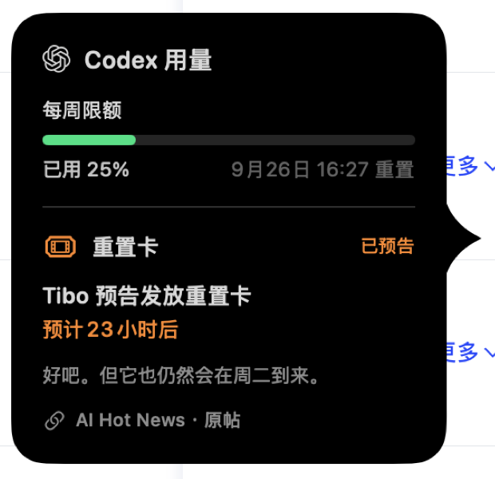

# Pulse Codex Reset

`Pulse Codex Reset` is a personal customization fork of
[`qunqin24/Pulse`](https://github.com/qunqin24/Pulse). Pulse remains the
upstream project; this repository carries a small set of features used by the
fork maintainer and is not an official Pulse distribution.

`Pulse Codex Reset` 是 [`qunqin24/Pulse`](https://github.com/qunqin24/Pulse)
的个人定制 fork。Pulse 仍是上游项目；本仓库只维护少量个人需要的功能，不是
Pulse 官方发行版。

## Differences from upstream / 与上游的差异

- **Optional Codex reset-news indicator.** An orange dot marks a public
  forecast; a green dot marks a public confirmation. Hovering Codex keeps
  provider-reported usage and the public report inside one pointed detail card.
- **Fork-safe updates.** Release bundles do not poll the upstream Sparkle feed,
  because installing an upstream update would silently remove these changes.
  No public fork release has been published yet; the maintainer builds from
  this repository's CI workflow.

- **可选 Codex 重置消息。** 有当前公开重置卡消息时，Codex 百分比旁显示圆点：
  预告为橙色、确认为绿色；悬停后，用量和重置消息合并在同一张有明确指向的详情卡中。
- **适合 fork 的更新边界。** 发行包不轮询上游 Sparkle 更新源，避免安装官方更新后
  静默丢失定制功能。目前尚无公开的 fork 发行包，维护者通过本仓库 CI 构建。

## Screenshots / 实机截图

### Codex usage and reset report / Codex 用量与重置消息

## Data boundary / 数据边界

The reset report is third-party public information, not an OpenAI entitlement
or a guaranteed reset time. It is displayed as a separate news section and
never replaces the provider-reported Codex quota. The feature is optional and
can be disabled in Settings.

重置消息来自第三方公开信息，不是 OpenAI 官方额度，也不保证实际重置时间。它始终以
独立新闻区域展示，不替换 Codex 自己报告的额度；该功能可以在设置中关闭。

## Upstream relationship / 上游关系

Bug fixes and generally useful provider support should continue to be proposed
upstream. Fork-only product choices stay here. The Apache-2.0 license and
upstream attribution are preserved.

通用 bug 修复与 provider 支持仍优先回馈上游；仅属于个人产品取舍的功能留在本 fork。
本仓库保留 Apache-2.0 许可证和完整上游署名。
